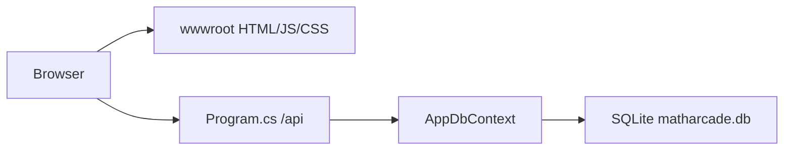

# MathArcade

Self-hosted math practice arcade for kids. Static HTML/JS games plus a small ASP.NET Core 9 API. SQLite stores players, high scores, and progress. There are no logins, Razor views, or a separate services layer.

## Architecture



**Hosting.** ASP.NET Core 9 minimal API in [`Program.cs`](Program.cs). Static files come from `wwwroot` (`UseDefaultFiles` + `UseStaticFiles`, `Cache-Control: no-cache`). Unknown routes fall back to `index.html`.

**Frontend.** Vanilla JS. The game catalog is the `GAMES` array in [`wwwroot/js/common.js`](wwwroot/js/common.js). Each game is a page under `wwwroot/games/` plus a script under `wwwroot/js/`. That HTML page owns its presentation in an inline `<style>` block — duplicate rank/HUD CSS rather than sharing it. Class names (`rank-badge`, `rank-C` … `rank-S`, `rank-legend`, `rank-up-banner`) may be copied; colors must stay local to the theme.

[`wwwroot/js/common.js`](wwwroot/js/common.js) is the shared *contract*: catalog, device token, scores, progress, and daily bonus unlock. Do not move per-game rank knobs or `nextRank` there.

Lobby uses [`wwwroot/css/site.css`](wwwroot/css/site.css). Admin uses [`wwwroot/css/admin.css`](wwwroot/css/admin.css). [`wwwroot/css/games.css`](wwwroot/css/games.css) is an unused generic `game-page` shell. Do not link it from full-screen games and do not grow it with rank or HUD skins.

**Backend.** All HTTP endpoints live in [`Program.cs`](Program.cs). Entities are in [`Models/`](Models/). EF Core SQLite is configured in [`Data/AppDbContext.cs`](Data/AppDbContext.cs). The database is created with `EnsureCreated()` on startup (no migrations).

**Identity.** Each browser gets a UUID in `localStorage` (`matharcade_device_token`) plus a display name (`matharcade_player_name`). There are no passwords. Family admin uses a magic word: header `X-Admin-Key` must match `Admin:MagicWord`.

**Data.** Three tables, with unique indexes on `Player.DeviceToken` and on `(PlayerId, GameId)` for scores and progress:

| Entity | What it stores |
|--------|----------------|
| `Player` | Display name and device token |
| `HighScore` | One best score per player per game |
| `GameProgress` | `DifficultyLevel` plus a `StatsJson` blob |

Math games use C→S ranks. Persist `stats.rank` (`"C"|"B"|"A"|"S"`) in `StatsJson` and `DifficultyLevel` 1–4 (`RANKS.indexOf(rank) + 1`). Rank-up knobs (timers, grid size, factors) stay in that game's JS. If `stats.rank` is missing, start at C — do not map leftover numeric `difficultyLevel` values into B/A/S. A saved session (any `saveProgress` that updates `updatedAt`) is what counts for the daily bonus, not a rank-up.

**Skill radar.** Each non-bonus topic is a pentagon with five axes. Each axis is one catalog game (`axisIndex` 0–4, unique within the topic). Unused spokes stay **Coming soon** at score 0. Axis fill is derived from saved ranks (unplayed = 0, C = 0.25, B = 0.5, A = 0.75, S = 1). Per-number games (Lava Leap, Avalanche Run) average the nine ×2–×10 ranks, so each letter bump is 1/9 of that axis. A full pentagon means S-rank on every game in that topic.

### API

| Method | Path | Purpose |
|--------|------|---------|
| `POST` | `/api/players` | Register or update a player by device token + name |
| `GET` | `/api/players/by-token/{deviceToken}` | Look up a player |
| `GET` | `/api/scores/{gameId}` | Top scores (limit 1–50, default 10) |
| `POST` | `/api/scores` | Submit a score (kept only if it beats the player's best) |
| `GET` | `/api/progress` | All progress for a device token |
| `GET` | `/api/progress/{gameId}` | Progress for one game |
| `PUT` | `/api/progress/{gameId}` | Save difficulty + stats JSON |
| `GET` | `/api/admin/scores/{gameId}` | Admin: list all scores |
| `DELETE` | `/api/admin/scores/{gameId}` | Admin: wipe that game's leaderboard |
| `DELETE` | `/api/admin/scores/{gameId}/{scoreId}` | Admin: delete one score |

Admin routes require the `X-Admin-Key` header.

### Key files

```
Program.cs                 All API endpoints
Data/AppDbContext.cs       EF Core + indexes
Models/                    Player, HighScore, GameProgress
wwwroot/index.html         Arcade lobby
wwwroot/admin.html         Family admin
wwwroot/js/common.js       Game catalog and shared client helpers
wwwroot/games/             One HTML page per game
wwwroot/js/                One script per game
```

## Games

Catalog source of truth: `GAMES` in [`wwwroot/js/common.js`](wwwroot/js/common.js).

| Game | Math focus |
|------|------------|
| Make 10 | Complements to 10 |
| Galaxy Maze | Multiplication |
| Prime Factor Rocket | Prime factorization (division) |
| Lava Leap | Skip counting up |
| Avalanche Run | Skip counting down |
| Prime Search | Prime recognition |
| Calendar Scramble | Month order (1st–12th) |
| Memory Match Math | Match expressions with answers |
| Feed the Cats | Doubles subtraction |
| Dino Dash | Daily bonus endless runner (no math) |

**Dino Dash** unlocks after a saved session in 7 different catalog math games today. `DAILY_BONUS_REQUIRED_COUNT` in `common.js` is `7`, so students can pick which activities to play. Set it to `null` to require every catalog math game, or change the number as the catalog grows.

To add a game, see [New games](#new-games). Brainstorms that are not ready to ship live in [`GAME_IDEAS.md`](GAME_IDEAS.md).

## New games

Each title is one HTML file under `wwwroot/games/` plus one script under `wwwroot/js/`, with presentation in an inline `<style>` block. Append a `GAMES` row in [`wwwroot/js/common.js`](wwwroot/js/common.js) (`topic`, `axisIndex` 0–4 unique within the topic, `axisLabel`, `rankMode`). Radar topics still target **exactly five** math games. Do not link `wwwroot/css/games.css`.

## Features

- **Lobby** at `/` — skill spider charts (one axis per game, C→S fill), topic picker, and a filtered activity list with personal C→S ranks, how-to, high scores, and player name
- **Progress** — per-game C→S rank (`stats.rank`) and stats saved to SQLite
- **Daily bonus** — lobby shows lock status until today's catalog sessions are done
- **Admin** at `/admin.html` — wipe a leaderboard or delete a single score

## Run locally

Needs the [.NET 9 SDK](https://dotnet.microsoft.com/download/dotnet/9.0).

```bash
dotnet run
```

Open http://localhost:5080. Uses `./data/matharcade.db` by default.

## Run with Docker

```bash
docker compose up --build
```

Open http://localhost:5087.

Player data lives in the `matharcade-data` Docker volume (`/data/matharcade.db` inside the container). Host port **5087** maps to container port **8080**.

[`docker-compose.yml`](docker-compose.yml) also attaches the service to an external Docker network named `web-core_default` (homelab reverse-proxy setup). Compose fails if that network does not exist. Create it once:

```bash
docker network create web-core_default
```

## Configuration

| Setting | Default | Notes |
|---------|---------|-------|
| `ConnectionStrings:Default` | `Data Source=./data/matharcade.db` | Docker overrides this to `/data/matharcade.db` |
| `Admin:MagicWord` | `change-me` | Sent as `X-Admin-Key` from `/admin.html` |

Override with `appsettings.json`, environment variables (`ConnectionStrings__Default`, `Admin__MagicWord`), or Compose `environment`. Do not commit a real magic word.
